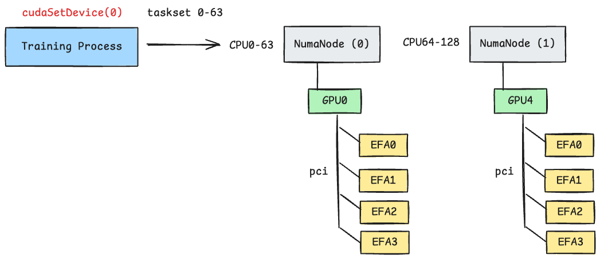
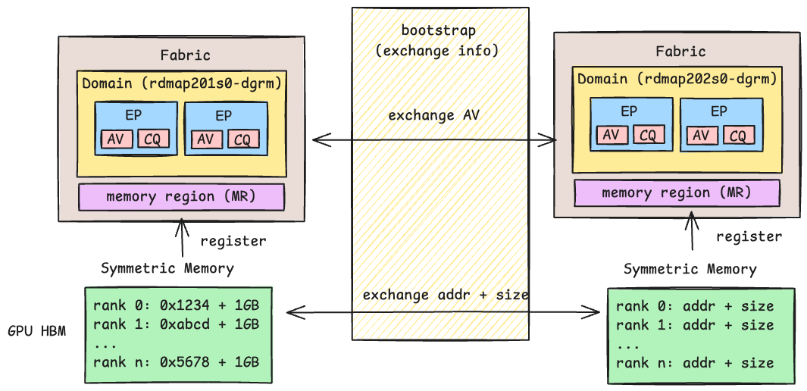
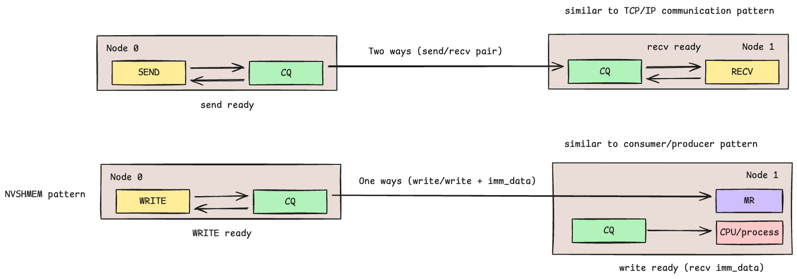
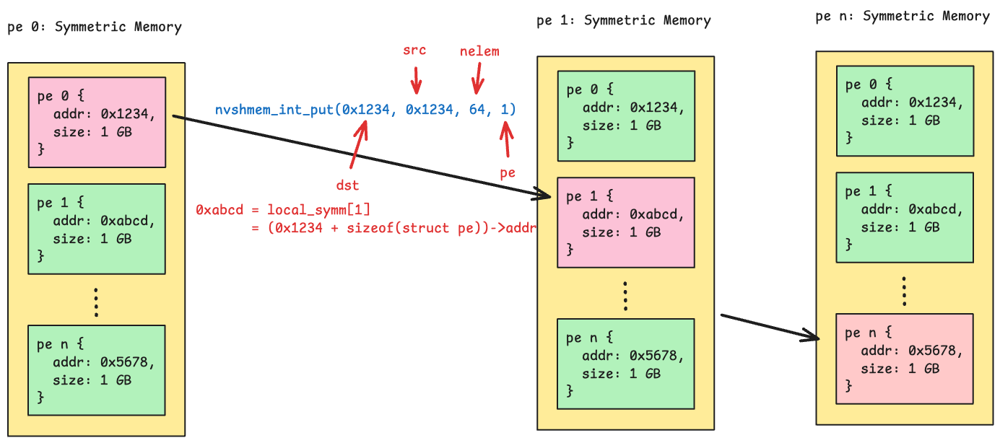
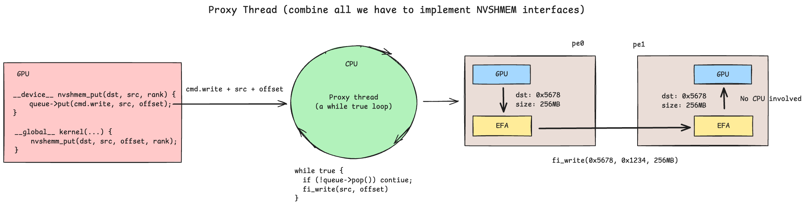

=========================================================
Building NVSHMEM from Scratch: GPU-Initiated Networking
=========================================================

.. meta::
   :description: A technical guide to building NVSHMEM-like GPU-initiated networking using proxy threads, RDMA over AWS EFA, GPUDirect, symmetric memory, and CUDA IPC for distributed LLM training and inference.
   :keywords: NVSHMEM, RDMA, GPUDirect, InfiniBand, NCCL, GPU communication, LLM training, distributed deep learning, MoE, DeepEP, CUDA, AWS EFA, libfabric, proxy thread, symmetric memory, CUDA IPC, All-to-All collective, GPU-initiated networking, GDRCopy, hwloc, DMA-BUF, OpenSHMEM

.. contents:: Table of Contents
    :backlinks: none

Abstract
--------

GPU-to-GPU communication is critical for large language model (LLM) training
and inference, as modern models cannot fit on a single GPU or even a single
node. This necessitates partitioning model parameters across GPUs and using
collective communication to aggregate results. NCCL is a widely-used collective
library that achieves high throughput over RDMA fabrics such as InfiniBand and
AWS Elastic Fabric Adapter (EFA). Recently, GPU-Initiated Networking (GIN) [3]_ has
gained attention for its ability to fuse CUDA kernels with GPUDirect
communication, reducing kernel launch overhead and improving overlap. DeepEP
[6]_ exemplifies this approach—a high-performance Mixture-of-Experts (MoE)
layer dispatch/combine implementation that significantly reduces All-to-All
collective latency using `NVSHMEM <https://github.com/NVIDIA/nvshmem>`_ with
InfiniBand GPUDirect Async (IBGDA). However, not all RDMA providers support
IBGDA (at least as of late 2025). Instead, they rely on a "Proxy Thread"
technique to achieve GIN. InfiniBand Reliable Connection (IBRC) uses this
approach, as do similar implementations like
`UCCL <https://github.com/uccl-project/uccl>`_ [4]_ and
`MSCCL++ <https://github.com/microsoft/mscclpp>`_ [5]_. In this article, we
present a systematic breakdown of how proxy thread solutions achieve
GPU-initiated behavior over AWS EFA, and describe the design and implementation
of a minimal NVSHMEM-like library.

.. note::
   All source code and benchmarks are available at
   `Libefaxx <https://github.com/crazyguitar/Libefaxx>`_.

Introduction
------------

The rapid scaling of LLMs has made efficient GPU-to-GPU communication a
first-class concern in distributed systems. Libraries such as NCCL [2]_
abstract collective operations over RDMA fabrics, but emerging workloads—
particularly MoE architectures—demand finer-grained, kernel-level control over
communication. NVSHMEM provides a GPU-initiated programming model where CUDA
kernels directly issue put/get operations, enabling overlap of computation and
communication without returning control to the host.

This article targets practitioners who wish to understand the internals of
NVSHMEM/OpenSHMEM by building one from scratch. We decompose the problem into
the following components and describe each in detail.

First, we discuss the **RDMA transport layer**, where we use libfabric [1]_ to
initialize fabric objects, create endpoints, and manage completion queues over
AWS EFA. We then examine **hardware topology** discovery using hwloc, which
enables NUMA-aware placement by mapping GPU-NIC affinity through the PCIe
hierarchy — a critical step for minimizing cross-switch latency on multi-NIC
instances. Next, we describe the **bootstrap** phase, in which peers exchange
endpoint addresses and memory region keys through an out-of-band channel (e.g.,
MPI or TCP) before any RDMA data transfer can occur.

With the transport established, we cover two **communication patterns**
supported by libfabric: two-sided SEND/RECV, which requires active
participation from both peers, and one-sided RDMA WRITE, which allows a sender
to write directly into remote registered memory without receiver involvement —
the natural fit for NVSHMEM's put/get semantics. We then present the
**GPU-CPU queue**, a multi-producer single-consumer (MPSC) structure that
enables GPU kernels to enqueue RDMA requests to a **proxy thread** — a
CPU-side thread that dequeues and issues fabric operations on behalf of the GPU,
bridging the gap when hardware does not support IBGDA.

Finally, we describe three remaining components that complete the design:
**symmetric memory**, which provides a globally addressable memory space across
all GPUs; **GPUDirect RDMA** via DMA-BUF, which enables zero-copy registration
of GPU memory for direct NIC access; and **CUDA IPC**, which provides
low-latency intra-node GPU-to-GPU data transfer through shared memory handles.

Fabric: RDMA Transport with libfabric and AWS EFA
--------------------------------------------------

To perform RDMA operations, applications typically use low-level libraries such
as `libibverbs <https://github.com/linux-rdma/rdma-core/tree/master>`_ (for
InfiniBand/RoCE) or `libfabric <https://github.com/ofiwg/libfabric>`_ (a
higher-level, provider-agnostic fabric interface). Since this article targets AWS
Elastic Fabric Adapter (EFA), we use ``libfabric`` — the recommended interface
for EFA. The AWS EFA provider in libfabric handles the
`Scalable Reliable Datagram (SRD) <https://aws.amazon.com/blogs/hpc/in-the-search-for-performance-theres-more-than-one-way-to-build-a-network/>`_
protocol internally, so applications do not need to manage reliability or
ordering at the transport layer.

libfabric Object Hierarchy
^^^^^^^^^^^^^^^^^^^^^^^^^^

The diagram below illustrates the core libfabric object hierarchy used to set
up RDMA communication over EFA:

- **Fabric** — represents the physical network (e.g., an EFA device).
- **Domain** — maps to a specific network interface, analogous to binding to an
  IP address. Each domain provides access to resources such as memory
  registration and address resolution.
- **Endpoint** — a communication channel, analogous to a socket. Each endpoint
  is associated with:

  - An **Address Vector (AV)** — a table that maps peer addresses for
    connectionless (datagram) communication.
  - A **Completion Queue (CQ)** — used to poll for RDMA operation completions
    (e.g., send/recv/write done).

The full initialization sequence can be found in
`efa.h <https://github.com/crazyguitar/Libefaxx/blob/main/src/include/rdma/fabric/efa.h#L199-L213>`_.

.. image:: ../../_static/blog/rdma/fabric.png
   :alt: libfabric object hierarchy diagram showing fabric, domain, endpoint, address vector, and completion queue relationships

Querying EFA Devices with fi_info
^^^^^^^^^^^^^^^^^^^^^^^^^^^^^^^^^

On AWS EC2 instances with EFA enabled (e.g., ``p4d.24xlarge``,
``p5.48xlarge``), available fabric providers can be queried using the
``fi_info`` utility:

.. code-block:: bash

    $ fi_info -p efa

    provider: efa
        fabric: efa
        domain: rdmap201s0-dgrm
        version: 203.10
        type: FI_EP_DGRAM
        protocol: FI_PROTO_EFA

The output shows that the EFA provider exposes a datagram endpoint
(``FI_EP_DGRAM``) using the ``FI_PROTO_EFA`` protocol. The ``domain`` field
identifies the specific EFA device. On multi-NIC instances (e.g.,
``p5.48xlarge`` with 32 EFA interfaces), ``fi_info`` lists multiple
domains — one per NIC — which is important for topology-aware placement
discussed in the next section.

Topology: GPU-NIC Affinity and NUMA-Aware Placement
----------------------------------------------------

Hardware topology awareness is essential for achieving optimal RDMA performance
in multi-GPU systems. On instances like AWS ``p5.48xlarge``, each GPU is
physically closer to certain EFA NICs and CPU cores through the PCIe topology.
Routing RDMA traffic through a topology-local NIC avoids costly cross-NUMA or
cross-PCIe-switch transfers.

The diagram below illustrates this principle. If a process is bound to GPU 0,
routing RDMA traffic through the EFA device on the same PCIe switch minimizes
latency. Using a distant NIC (e.g., one closer to GPU 4) forces data to
traverse additional PCIe hops, increasing transfer time.

Detecting Topology with hwloc
^^^^^^^^^^^^^^^^^^^^^^^^^^^^^

One approach to discovering hardware topology is to parse
``/sys/bus/pci/devices`` directly, but this is error-prone and difficult to
maintain. A more robust approach is to use
`hwloc <https://github.com/open-mpi/hwloc>`_ — a portable library for
querying the hierarchical topology of CPUs, caches, NUMA nodes, and PCI
devices. The programming pattern resembles a depth-first search (DFS) pre-order
traversal over a tree data structure. Basic usage examples are available in the
`hwloc cheat sheet <../cuda/cuda_hwloc.rst>`_. For a real-world example of
detecting GPU-NIC affinity on AWS ``p5.48xlarge`` and using ``taskset`` to pin
processes to topology-local CPU cores, see
`affinity.h <https://github.com/crazyguitar/Libefaxx/blob/main/src/include/affinity/affinity.h>`_.

Bootstrap: Out-of-Band Connection Setup
----------------------------------------

Unlike traditional networking stacks where protocols like ARP handle address
discovery automatically, RDMA requires an explicit out-of-band (OOB) exchange
to set up connections. Before any RDMA data transfer can occur, peers must
exchange endpoint addresses and memory region keys through a separate control
channel — a process known as **bootstrapping**.

Common bootstrap methods in the RDMA ecosystem include:

- **MPI** — NCCL and NVSHMEM can use MPI collectives (e.g.,
  ``MPI_Allgather``) to distribute connection identifiers such as
  ``nccl_id`` across all ranks.
- **TCPStore** — PyTorch's distributed runtime uses
  `TCPStore <https://pytorch.org/docs/stable/distributed.html#torch.distributed.TCPStore>`_
  as a key-value store to exchange connection information (e.g., rank
  addresses, NCCL IDs) between processes.

Once the RDMA connection is established and memory regions are registered, the
OOB channel is no longer needed for data transfer. In our implementation, the
symmetric memory layer uses ``MPI_Allgather`` to exchange remote RDMA addresses
and memory region sizes. Further details are available in
`fabric.h <https://github.com/crazyguitar/Libefaxx/blob/main/src/include/bootstrap/mpi/fabric.h>`_.

Communication: RDMA Verbs and Data Transfer Patterns
-----------------------------------------------------

libfabric supports two primary communication patterns, each suited to different
use cases.

Two-Sided Communication (SEND/RECV)
^^^^^^^^^^^^^^^^^^^^^^^^^^^^^^^^^^^^

This pattern resembles traditional TCP/IP socket communication. Both the sender
and receiver must actively participate — the sender calls ``fi_sendmsg`` and
the receiver calls ``fi_recvmsg``. Each side's completion queue (CQ) signals
when its respective operation completes. This is useful when the receiver needs
to know exactly when data arrives and control where it lands.

One-Sided Communication (RDMA WRITE)
^^^^^^^^^^^^^^^^^^^^^^^^^^^^^^^^^^^^^

This pattern resembles a producer-consumer model with shared memory. The writer
uses ``fi_writemsg`` to write directly into the remote node's registered memory
region (MR) — the remote CPU is not involved in the data path. Only the
writer's CQ signals completion; the remote side has no automatic notification
that data arrived.

To notify the remote side, RDMA provides **write with immediate data**
(``FI_REMOTE_CQ_DATA``). The writer attaches a small immediate value to the
write operation. When the write completes, the remote CQ receives a completion
event containing this immediate data, signaling that new data is available.
This is commonly used as an "end-of-write" tag.

Implementation examples for both patterns are available in Libefaxx:
`Send/Recv benchmark <https://github.com/crazyguitar/Libefaxx/tree/main/experiments/sendrecv>`_ and
`Write benchmark <https://github.com/crazyguitar/Libefaxx/tree/main/experiments/write>`_.

Why NVSHMEM Uses One-Sided Semantics
^^^^^^^^^^^^^^^^^^^^^^^^^^^^^^^^^^^^^

The name "NVSHMEM" (and OpenSHMEM) might suggest it is merely a shared memory
IPC library. However, NVSHMEM also supports inter-node communication over RDMA.
The "SHMEM" terminology reflects the programming model: like shared memory IPC,
the communication is one-sided — a producer writes to a remote address without
the consumer explicitly receiving. RDMA one-sided write maps naturally to this
model: the caller specifies a remote virtual address and offset, and the NIC
performs a DMA transfer directly into remote memory. This is why one-sided RDMA
is the foundation for NVSHMEM's ``nvshmem_put`` / ``nvshmem_get`` APIs.

GPU-CPU Queue: Low-Latency Signaling for Proxy Threads
-------------------------------------------------------

The proxy thread architecture relies on a GPU-CPU queue to coordinate between
GPU kernels and the CPU thread that issues RDMA operations. Since GPU kernels
run thousands of threads, this is typically implemented as a multi-producer,
single-consumer (MPSC) queue — many GPU threads enqueue requests, while a
single CPU proxy thread dequeues and processes them.

.. image:: ../../_static/blog/rdma/mpsc.png
   :alt: Multi-producer single-consumer (MPSC) queue diagram showing GPU threads enqueueing RDMA requests to CPU proxy thread

Several memory strategies can implement this queue, each with different
trade-offs:

- `GDRCopy <https://github.com/NVIDIA/gdrcopy>`_ — Maps GPU memory to CPU
  address space via PCIe BAR (Base Address Register). Provides the lowest
  latency for small transfers since the CPU can directly read/write GPU memory
  without invoking CUDA APIs.
- **CUDA Unified Memory** — Automatically migrates pages between GPU and CPU
  on access. Simpler to program but incurs page fault overhead, making it
  less predictable for latency-sensitive signaling.
- **Pinned (Page-Locked) Host Memory** — CPU memory allocated with
  ``cudaHostAlloc`` that GPUs can access directly via PCIe. A good balance
  between simplicity and performance.

For benchmarks comparing these approaches, see the
`Command Queue Implementation Comparison <https://github.com/crazyguitar/Libefaxx/tree/main/experiments#command-queue-implementation-comparison>`_
in Libefaxx.

Symmetric Memory
----------------

In NVSHMEM's `Memory Model <https://docs.nvidia.com/nvshmem/api/gen/mem-model.html>`_,
symmetric memory refers to allocations that have the same name, type, and size
on all PEs (Processing Elements). This uniformity is required because each PE
must maintain RDMA metadata — remote virtual addresses and memory region
sizes — for every other PE, so that one-sided operations can directly access
remote memory without coordination.

The diagram below illustrates a straightforward implementation of the symmetric
memory data structure. Each PE's local symmetric object holds both a block of
its own allocated memory and the remote virtual addresses of all other PEs.
When a shmem-like API such as ``nvshmem_int_put`` is called, the library
looks up the target PE's remote address and issues an RDMA write directly into
that region.

For implementation details, see
`memory.h <https://github.com/crazyguitar/Libefaxx/blob/main/src/include/rdma/memory.h>`_
in Libefaxx.

GPUDirect RDMA
--------------

Standard RDMA requires data to reside in registered host memory. When the
source data lives on a GPU, a naive approach copies GPU memory to a pinned host
buffer, registers it, and then issues the RDMA operation — adding a full
device-to-host transfer to every communication. GPUDirect RDMA eliminates this
copy by allowing the NIC to read from and write to GPU memory directly over
PCIe, without staging through host memory.

DMA-BUF: Exporting GPU Memory to the NIC
^^^^^^^^^^^^^^^^^^^^^^^^^^^^^^^^^^^^^^^^^

The Linux kernel's `DMA-BUF <https://docs.kernel.org/driver-api/dma-buf.html>`_
framework provides a standard mechanism for sharing memory buffers between
devices. For GPUDirect RDMA, the workflow is:

1. Allocate GPU memory with ``cudaMalloc``.
2. Export a DMA-BUF file descriptor using
   ``cuMemGetHandleForAddressRange`` with ``CU_MEM_RANGE_HANDLE_TYPE_DMA_BUF_FD``.
3. Register the memory with libfabric using ``fi_mr_regattr`` with
   ``FI_HMEM_CUDA`` and the DMA-BUF descriptor in ``fi_mr_dmabuf``.

Once registered, the NIC can perform RDMA read/write operations directly
against GPU memory through GPU virtual address. The DMA-BUF file descriptor is
closed after registration, and the memory region is deregistered when no longer needed.

For the full implementation, see
`buffer.h <https://github.com/crazyguitar/Libefaxx/blob/main/src/include/rdma/fabric/buffer.h>`_
in Libefaxx.

CUDA IPC
--------

RDMA handles inter-node communication, but GPUs within the same node are
connected by NVLink — a high-bandwidth interconnect that provides up to
3600 Gbps on H100 GPUs, far exceeding what any network fabric can offer.
CUDA IPC (Inter-Process Communication) allows processes to share GPU memory
across process boundaries, enabling direct GPU-to-GPU transfers over NVLink
without involving the CPU or NIC.

IPC Handle Exchange
^^^^^^^^^^^^^^^^^^^

The setup follows a pattern similar to RDMA bootstrapping:

1. Each rank calls ``cudaIpcGetMemHandle`` to export a handle for its GPU
   buffer.
2. Handles are exchanged across local ranks via ``MPI_Allgather`` (or any
   OOB channel).
3. Each rank calls ``cudaIpcOpenMemHandle`` on peer handles to obtain a
   device pointer that maps into the remote GPU's memory.

Once opened, a GPU kernel can write directly to a peer GPU's buffer using the
mapped pointer — the transfer occurs over NVLink with no CPU involvement. A
``__threadfence_system()`` ensures writes are visible to the remote GPU. This
access pattern — writing to a remote address without receiver participation —
is identical to RDMA one-sided semantics, which makes CUDA IPC a natural fit
for the symmetric memory abstraction.

Integration with Symmetric Memory
^^^^^^^^^^^^^^^^^^^^^^^^^^^^^^^^^^

Because CUDA IPC and RDMA one-sided write share the same put/get programming
model — both operate on a remote virtual address without receiver
participation — the symmetric memory layer can store IPC pointers and RDMA
remote addresses side by side in a single data structure. At runtime, the
library checks whether the target PE resides on the same node. If so, it
writes directly through the IPC pointer over NVLink; otherwise, it enqueues
the request to the proxy thread for RDMA delivery. This routing is transparent
to the caller, and the performance difference is substantial: NVLink IPC
transfers can reach ~2971 Gbps (78% of H100 NVLink peak), as shown in the
`NVLink IPC benchmark <https://github.com/crazyguitar/Libefaxx/tree/main/experiments#nvlink-gpu-to-gpu-communication-performance>`_.
For implementation details, see `symmetric.h <https://github.com/crazyguitar/Libefaxx/blob/main/src/include/rdma/symmetric.h>`_
in Libefaxx.

Simple NVSHMEM Implementation
-----------------------------

With all the building blocks in place — RDMA transport, topology discovery,
bootstrap, proxy thread, symmetric memory, GPUDirect RDMA, and CUDA IPC — we
can assemble a minimal NVSHMEM-like API. The goal is to provide familiar
``shmem_*`` functions that CUDA kernels call directly, while the library
transparently handles intra-node vs. inter-node routing underneath.

API Surface
^^^^^^^^^^^

The host-side API mirrors NVSHMEM's structure:

- ``shmem_init`` / ``shmem_finalize`` — bootstrap MPI, discover topology,
  create EFA endpoints, and establish connections.
- ``shmem_malloc`` / ``shmem_free`` — allocate symmetric memory with
  DMA-BUF registration, exchange RDMA keys via ``MPI_Sendrecv``, and
  exchange CUDA IPC handles among local ranks.
- ``shmem_my_pe`` / ``shmem_n_pes`` — query the current PE index and total
  PE count.
- ``shmem_barrier_all`` — global barrier across all PEs.

On the device side, ``shmem_int_p`` (and other typed variants) perform a
one-sided put from within a CUDA kernel. The implementation checks the target
PE's IPC pointer: if non-null (same node), it writes directly over NVLink;
otherwise, it writes to local symmetric memory, issues a ``__threadfence_system``,
and pushes a request to the proxy thread's MPSC queue for RDMA delivery. The
blocking variant calls ``shmem_quiet`` to wait until the proxy thread confirms
completion.

Example
^^^^^^^

The following example demonstrates a simple ring shift — each PE writes its
rank to the next PE's symmetric buffer, equivalent to the
`NVSHMEM example <https://docs.nvidia.com/nvshmem/api/using.html#example-nvshmem-program>`_:

.. code-block:: cuda

    #include <shmem/shmem.cuh>

    template <typename Ctx>
    __global__ void simple_shift(Ctx ctx, int* target, int mype, int npes) {
      int peer = (mype + 1) % npes;
      shmem_int_p(ctx, target, mype, peer);
    }

    int main() {
      shmem_init();
      int mype = shmem_my_pe();
      int npes = shmem_n_pes();
      int* target = static_cast<int*>(shmem_malloc(sizeof(int)));
      auto ctx = shmem_ctx(target);

      simple_shift<<<1, 1>>>(ctx, target, mype, npes);
      // ... run proxy thread for inter-node RDMA if needed ...

      shmem_barrier_all();
      shmem_free(target);
      shmem_finalize();
    }

For the full API implementation, see
`shmem.cuh <https://github.com/crazyguitar/Libefaxx/blob/main/src/include/shmem/shmem.cuh>`_.
For the complete working example including proxy thread setup, see the
`shmem experiment <https://github.com/crazyguitar/Libefaxx/tree/main/experiments/shmem>`_
in Libefaxx.

Conclusion
----------

The goal of this article was to learn how NVSHMEM-like libraries work by
building one from scratch. Recent Mixture-of-Experts (MoE) implementations
such as DeepEP have shown that high-performance GPU-initiated communication
can significantly improve dispatch/combine latency beyond what naive All-to-All
collectives achieve. To better understand the technologies behind these
projects, I conducted a series of small experiments covering RDMA transport
with libfabric, NUMA-aware topology discovery, out-of-band bootstrapping,
one-sided communication, MPSC queues for proxy threads, symmetric memory,
GPUDirect RDMA via DMA-BUF, and CUDA IPC over NVLink.

I am grateful to the open-source projects referenced throughout this article —
NVSHMEM, UCCL, MSCCL++, and DeepEP — whose designs and source code were
invaluable in deepening my understanding of RDMA and CUDA communication. This
article represents my current understanding, and I welcome any corrections or
suggestions. For additional experiments and benchmark results, please refer to
the `Libefaxx experiments <https://github.com/crazyguitar/Libefaxx/tree/main/experiments#readme>`_.

References
----------

.. [1] Le, Q., "Libfabric EFA Series," 2024. Available: https://le.qun.ch/en/blog/2024/12/25/libfabric-efa-0-intro/

.. [2] Punniyamurthy, K. et al., "Optimizing Distributed ML Communication with Collective Operations," *arXiv preprint arXiv:2305.06942*, 2023.

.. [3] Liu, S. et al., "GPU-Initiated Networking," *arXiv preprint arXiv:2511.15076*, 2025.

.. [4] UCCL Project, "UCCL: User-space Collective Communication Library." Available: https://github.com/uccl-project/uccl

.. [5] Microsoft, "MSCCL++: Multi-Scale Collective Communication Library." Available: https://github.com/microsoft/mscclpp

.. [6] DeepSeek-AI, "DeepEP: Expert Parallelism with GPU-Initiated Communication." Available: https://github.com/deepseek-ai/DeepEP
